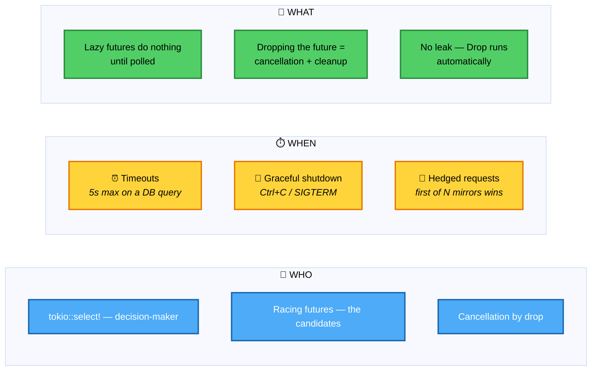
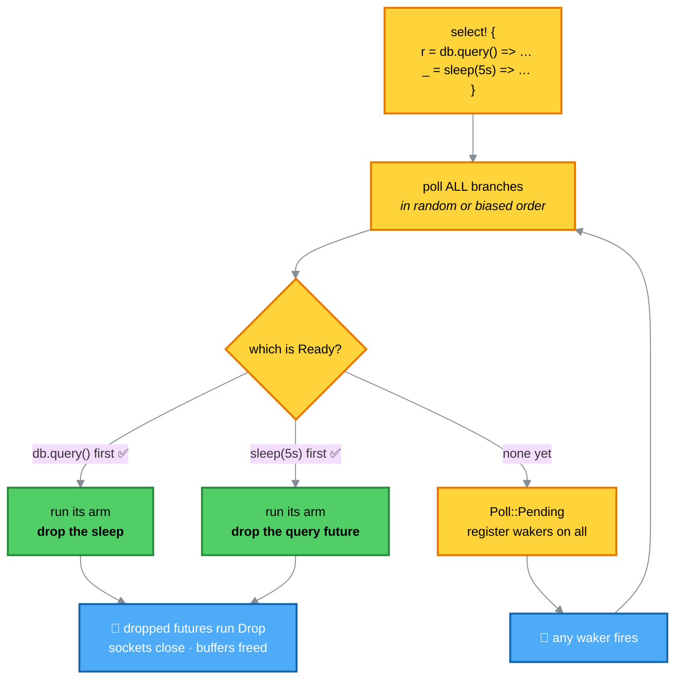
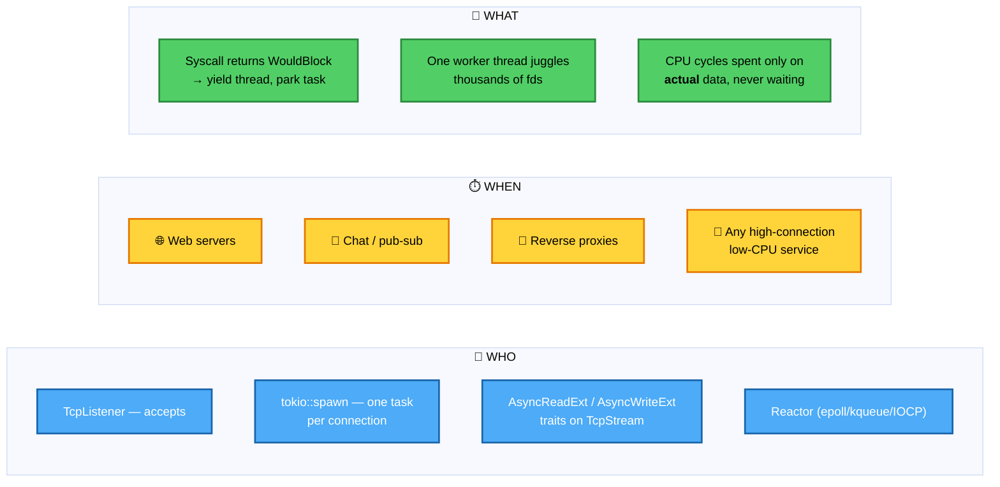
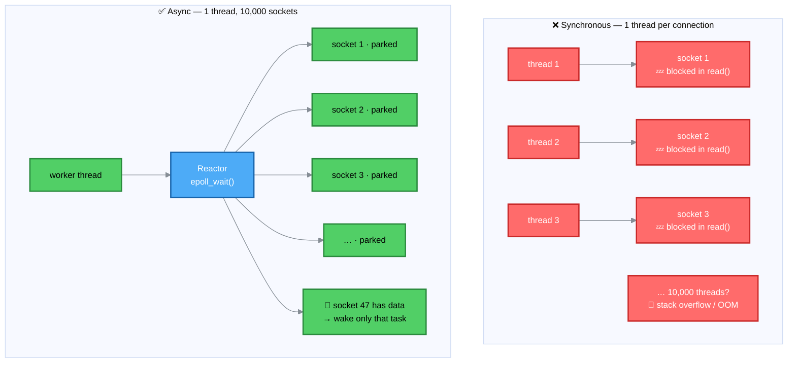
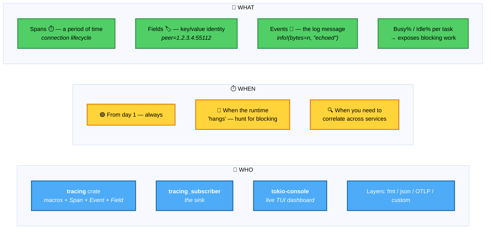
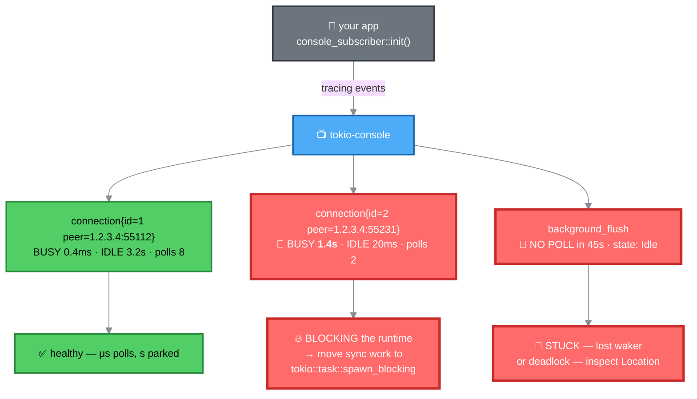
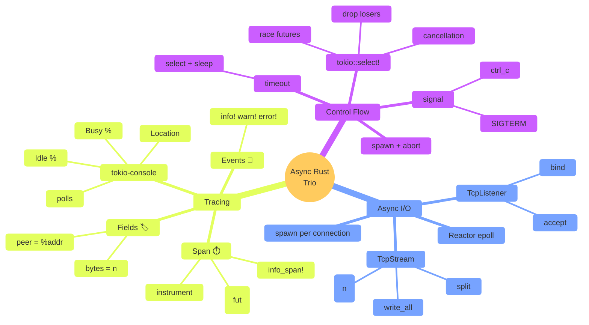

# 🎛️ Control Flow, I/O, and Debugging — Functions, Who, When, What + Animations

Three topics, three complete breakdowns, three runnable animations. Each section has a **function table**, a **Who/When/What** card, a **Mermaid diagram**, and an **HTML animation** you can save and open.

---

# 🔀 Part 1 — Control Flow & Cancellation

## 📋 Functions & APIs

| Function / Macro | Signature | Purpose |
|---|---|---|
| `tokio::select!` | `select! { biased; branch = fut => {…}, … }` | Race futures; run the **first** one that completes, drop the rest |
| `tokio::time::timeout` | `timeout(dur, fut) -> Result<T, Elapsed>` | Sugar over `select!` with a sleep |
| `tokio::time::sleep` | `sleep(dur) -> Sleep` | Async delay — the "timer" arm |
| `tokio::signal::ctrl_c` | `async fn ctrl_c() -> io::Result<()>` | Future resolved on SIGINT |
| `tokio::signal::unix::signal` | `signal(SignalKind::terminate())` | Any Unix signal (SIGTERM, SIGHUP, …) |
| `tokio::spawn` | `spawn(fut) -> JoinHandle<T>` | Spawn cancellable background task |
| `JoinHandle::abort` | `handle.abort()` | Explicit cancellation |
| `futures::future::select_all` | `select_all(iter) -> (Out, usize, Vec<F>)` | Race many, keep losers |
| `tokio::sync::watch` | `watch::channel(init)` | Broadcast shutdown signal to many tasks |

## 🧑 Who / ⏱️ When / 🎯 What



## 🔀 How `select!` decides



## 🎥 Runnable Animation — `select.html`

```html
<!DOCTYPE html>
<html>
<head><meta charset="utf-8"><title>tokio::select! — race & cancel</title>
<style>
  :root{--bg:#0d1117;--panel:#161b22;--line:#30363d;--win:#51cf66;--lose:#ff6b6b;
        --db:#4dabf7;--timer:#ffd43b;--pend:#ffa94d}
  *{box-sizing:border-box}
  body{margin:0;background:var(--bg);color:#e6edf3;
       font:13px/1.55 ui-monospace,Menlo,monospace;padding:20px}
  h1{font-size:15px;color:#7d8590;font-weight:400;margin:0 0 14px;letter-spacing:.4px}
  button{background:#238636;border:0;color:#fff;padding:8px 16px;border-radius:8px;
         font:inherit;cursor:pointer;margin-right:8px;margin-bottom:14px}
  button:disabled{opacity:.4;cursor:default}
  label{font-size:12px;color:#7d8590;cursor:pointer;margin-right:14px}
  #stage{position:relative;background:var(--panel);border:1px solid var(--line);
         border-radius:14px;padding:22px;min-height:360px}
  .branch{display:flex;align-items:center;gap:14px;margin-bottom:14px;
          border:2px solid var(--line);border-radius:10px;padding:12px;
          transition:.35s;background:#0d1117}
  .branch.db{border-color:var(--db)} .branch.timer{border-color:var(--timer)}
  .branch.win{border-color:var(--win);box-shadow:0 0 22px -4px var(--win);
              background:#0f2e1a}
  .branch.lose{border-color:var(--lose);opacity:.35;background:#2a0f0f}
  .name{width:130px;font-weight:700}
  .name.db{color:var(--db)} .name.timer{color:var(--timer)}
  .bar{flex:1;height:22px;background:#21262d;border-radius:6px;overflow:hidden}
  .bar>div{height:100%;width:0;transition:width .25s linear}
  .bar.db>div{background:var(--db)}
  .bar.timer>div{background:var(--timer)}
  .status{width:120px;font-size:11px;text-align:right;color:#7d8590}
  .status.pend{color:var(--pend)} .status.win{color:var(--win)} .status.lose{color:var(--lose)}
  #log{margin-top:14px;background:#010409;border:1px solid var(--line);
       border-radius:10px;padding:10px;height:150px;overflow:auto;font-size:11px}
  #log div{padding:1px 0;border-bottom:1px solid #161b22;animation:in .3s}
  @keyframes in{from{opacity:0;transform:translateX(-6px)}}
  .lv-ok{color:var(--win)} .lv-err{color:var(--lose)} .lv-pend{color:var(--pend)}
  .lv-dim{color:#7d8590}
</style></head><body>
<h1>tokio::select! { db.query() =&gt; … , sleep(5s) =&gt; … }</h1>
<button id="play">▶ Race</button>
<label><input type="checkbox" id="dbWins" checked> DB responds fast</label>

<div id="stage">
  <div class="branch db" id="bDb">
    <div class="name db">🔵 db.query()</div>
    <div class="bar db"><div id="dbBar"></div></div>
    <div class="status pend" id="dbSt">pending</div>
  </div>
  <div class="branch timer" id="bTimer">
    <div class="name timer">🟡 sleep(5s)</div>
    <div class="bar timer"><div id="tBar"></div></div>
    <div class="status pend" id="tSt">pending</div>
  </div>
</div>
<div id="log"></div>
<script>
const $=s=>document.querySelector(s), logEl=$('#log');
const wait=ms=>new Promise(r=>setTimeout(r,ms));
function log(m,c=''){const d=document.createElement('div');d.className=c;d.textContent=m;
  logEl.appendChild(d);logEl.scrollTop=logEl.scrollHeight;}
function setStatus(el,t,c){el.textContent=t;el.className='status '+c;}

async function run(){
  $('#play').disabled=true; logEl.innerHTML='';
  $('#bDb').className='branch db'; $('#bTimer').className='branch timer';
  $('#dbBar').style.width='0%'; $('#tBar').style.width='0%';
  setStatus($('#dbSt'),'pending','pend'); setStatus($('#tSt'),'pending','pend');

  const dbFast = $('#dbWins').checked;
  const dbDur = dbFast ? 1800 : 99999;    // 1.8s "fast" or effectively never
  const timerDur = 5000;

  log('▶ entering select! — polling all branches', 'lv-dim');
  await wait(300);
  log('   db.query() → Poll::Pending 🛑 · registered waker', 'lv-pend');
  log('   sleep(5s)  → Poll::Pending 🛑 · registered waker', 'lv-pend');
  await wait(200);

  log('⏳ both branches racing…', 'lv-dim');
  const t0=performance.now();
  let winner=null;

  while(!winner){
    const el = performance.now()-t0;
    const dbPct = Math.min(100, el/dbDur*100);
    const tPct  = Math.min(100, el/timerDur*100);
    $('#dbBar').style.width=dbPct+'%';
    $('#tBar').style.width=tPct+'%';
    if (dbPct>=100 && winner===null) winner='db';
    if (tPct >=100 && winner===null) winner='timer';
    await wait(40);
  }

  if(winner==='db'){
    $('#bDb').classList.add('win'); setStatus($('#dbSt'),'✅ Ready','win');
    $('#bTimer').classList.add('lose'); setStatus($('#tSt'),'❌ dropped','lose');
    log('🔵 db.query() returned Ready ✅', 'lv-ok');
    log('   select! runs its arm', 'lv-ok');
    log('   🧹 sleep(5s) future DROPPED — no leak', 'lv-dim');
    log('✅ got the answer in ~1.8s, saved 3.2s', 'lv-ok');
  } else {
    $('#bTimer').classList.add('win'); setStatus($('#tSt'),'✅ Ready','win');
    $('#bDb').classList.add('lose'); setStatus($('#dbSt'),'❌ dropped','lose');
    log('🟡 sleep(5s) fired first ✅', 'lv-ok');
    log('   select! runs the timeout arm', 'lv-ok');
    log('   🧹 db.query() future DROPPED — TCP socket closed, buffers freed', 'lv-err');
    log('⏰ TIMEOUT — but the runtime is NOT stuck', 'lv-ok');
  }
  $('#play').disabled=false;
}
$('#play').addEventListener('click',run);
</script></body></html>
```

---

# 🔌 Part 2 — Asynchronous I/O

## 📋 Functions & APIs

| Function / Trait | Where | Purpose |
|---|---|---|
| `TcpListener::bind(addr)` | `tokio::net` | Create async listening socket |
| `TcpListener::accept()` | `tokio::net` | Await the next incoming connection (cancel-safe) |
| `TcpStream::read(&mut buf)` | `AsyncReadExt` | Non-blocking read — returns `Ok(n)` bytes |
| `TcpStream::write_all(&buf)` | `AsyncWriteExt` | Non-blocking write loop — guaranteed all bytes |
| `TcpStream::split()` | `tokio::net` | Split into owned read + write halves for concurrent use |
| `BufReader::new(stream)` | `tokio::io` | Add buffering (`.read_line()`, `.lines()`) |
| `tokio::io::copy(&mut r, &mut w)` | `tokio::io` | Zero-copy-ish piping between any `AsyncRead`/`AsyncWrite` |
| `tokio::spawn(fut)` | runtime | One task per connection |
| `TcpStream::set_nodelay(true)` | `tokio::net` | Disable Nagle for low-latency protocols |

## 🧑 Who / ⏱️ When / 🎯 What



## 🔌 Sync vs async — why the thread never blocks



## 🎥 Runnable Animation — `async_io.html`

```html
<!DOCTYPE html>
<html>
<head><meta charset="utf-8"><title>Async I/O — 1 thread, N sockets</title>
<style>
  :root{--bg:#0d1117;--panel:#161b22;--line:#30363d;--thread:#4dabf7;
        --sock:#9775fa;--park:#6c757d;--ready:#51cf66;--wake:#ffd43b}
  *{box-sizing:border-box}
  body{margin:0;background:var(--bg);color:#e6edf3;
       font:13px/1.55 ui-monospace,Menlo,monospace;padding:20px}
  h1{font-size:15px;color:#7d8590;font-weight:400;margin:0 0 14px}
  button{background:#238636;border:0;color:#fff;padding:8px 16px;border-radius:8px;
         font:inherit;cursor:pointer;margin-bottom:14px}
  button:disabled{opacity:.4;cursor:default}
  #stage{position:relative;background:var(--panel);border:1px solid var(--line);
         border-radius:14px;padding:20px;min-height:420px}
  .center{display:flex;flex-direction:column;align-items:center;gap:12px;margin-bottom:18px}
  #thread{border:3px solid var(--thread);color:var(--thread);border-radius:12px;
          padding:12px 22px;font-weight:700;text-align:center;transition:.3s}
  #thread.busy{box-shadow:0 0 30px -4px var(--thread);transform:scale(1.06)}
  #thread.idle{border-color:var(--park);color:var(--park);opacity:.55}
  #reactor{border:2px dashed var(--wake);color:var(--wake);border-radius:10px;
           padding:8px 18px;font-size:12px}
  #reactor.fire{background:#3d2a00;box-shadow:0 0 22px -4px var(--wake)}
  #sockets{display:grid;grid-template-columns:repeat(8,1fr);gap:8px;margin-top:14px}
  .sk{position:relative;border:2px solid var(--sock);border-radius:8px;padding:8px 6px;
      text-align:center;font-size:10px;background:#0d1117;transition:.4s}
  .sk .id{font-weight:700;color:var(--sock)}
  .sk .state{font-size:9px;color:#7d8590;margin-top:4px}
  .sk.parked{border-color:var(--park);opacity:.5}
  .sk.parked .id{color:var(--park)}
  .sk.ready{border-color:var(--ready);box-shadow:0 0 16px -3px var(--ready);
            background:#0f2e1a}
  .sk.ready .id{color:var(--ready)}
  .sk.pumping{animation:pulse .5s infinite alternate}
  @keyframes pulse{from{transform:scale(1)}to{transform:scale(1.07)}}
  #log{margin-top:16px;background:#010409;border:1px solid var(--line);
       border-radius:10px;padding:10px;height:150px;overflow:auto;font-size:11px}
  #log div{padding:1px 0;border-bottom:1px solid #161b22;animation:in .3s}
  @keyframes in{from{opacity:0;transform:translateX(-6px)}}
  .lv-ok{color:var(--ready)} .lv-park{color:var(--park)} .lv-wake{color:var(--wake)}
  .lv-dim{color:#7d8590}
</style></head><body>
<h1>One worker thread · one epoll reactor · 16 parked sockets</h1>
<button id="play">▶ Run</button>
<div id="stage">
  <div class="center">
    <div id="thread">🧵 worker thread</div>
    <div id="reactor">⚛️ reactor · epoll_wait()</div>
  </div>
  <div id="sockets"></div>
</div>
<div id="log"></div>
<script>
const $=s=>document.querySelector(s), logEl=$('#log'), sockets=$('#sockets');
const wait=ms=>new Promise(r=>setTimeout(r,ms));
function log(m,c=''){const d=document.createElement('div');d.className=c;d.textContent=m;
  logEl.appendChild(d);logEl.scrollTop=logEl.scrollHeight;}
for(let i=1;i<=16;i++){
  const s=document.createElement('div');
  s.className='sk';s.id='sk'+i;
  s.innerHTML=`<div class="id">🔌 ${i}</div><div class="state">idle</div>`;
  sockets.appendChild(s);
}
async function run(){
  $('#play').disabled=true;logEl.innerHTML='';
  document.querySelectorAll('.sk').forEach(s=>{
    s.className='sk'; s.querySelector('.state').textContent='idle';});
  $('#thread').className=''; $('#reactor').className=''; $('#thread').textContent='🧵 worker thread';

  log('🔌 16 clients connect · 16 tasks spawned', 'lv-dim');
  await wait(400);
  $('#thread').textContent='🧵 worker · running 16 tasks';
  for(let i=1;i<=16;i++){
    await wait(60);
    log(`   task ${i}: socket.read(&mut buf).await → Pending 🛑`, 'lv-park');
    const s=$('#sk'+i); s.classList.add('parked');
    s.querySelector('.state').textContent='parked';
  }
  await wait(400);

  log('😴 all 16 parked · thread fully free', 'lv-park');
  $('#thread').classList.add('idle');
  $('#thread').textContent='🧵 worker · idle 💤';
  await wait(700);

  // random wakeups
  log('⚛️ reactor: epoll_wait() — no data yet', 'lv-wake');
  $('#reactor').classList.add('fire');
  await wait(800);
  $('#reactor').classList.remove('fire');

  const arrivals=[3,7,11,14];
  for(const n of arrivals){
    log(`⚛️ reactor: fd ${n} readable → waker.wake()`, 'lv-wake');
    $('#reactor').classList.add('fire');
    const s=$('#sk'+n);
    s.classList.remove('parked'); s.classList.add('ready','pumping');
    s.querySelector('.state').textContent='data!';
    await wait(180);
    $('#reactor').classList.remove('fire');

    $('#thread').classList.remove('idle');
    $('#thread').classList.add('busy');
    $('#thread').textContent=`🧵 worker · polling task ${n}`;
    log(`   ▶ thread runs task ${n} ONLY`, 'lv-ok');
    await wait(400);
    log(`   task ${n}: read → Ok(n), write_all → echo ✅`, 'lv-ok');
    s.classList.remove('pumping','ready');
    s.querySelector('.state').textContent='parked again';
    await wait(200);
    s.classList.add('parked');
    $('#thread').classList.remove('busy');
    $('#thread').classList.add('idle');
    $('#thread').textContent='🧵 worker · idle 💤';
    await wait(300);
  }

  log('✅ 16 sockets handled by ONE thread · no blocking', 'lv-ok');
  $('#thread').classList.remove('idle');
  $('#thread').textContent='🧵 worker thread';
  $('#play').disabled=false;
}
$('#play').addEventListener('click',run);
</script></body></html>
```

---

# 🐛 Part 3 — Tracing & Debugging

## 📋 Functions, Macros & APIs

| Item | Kind | Purpose |
|---|---|---|
| `tracing::info!` / `warn!` / `error!` / `debug!` / `trace!` | macro | Emit a **structured event** at a level |
| `tracing::info_span!("name", field = val)` | macro | Create a **span** — a period of time with context |
| `#[tracing::instrument]` | attribute | Auto-wrap an async fn in a span |
| `.instrument(span)` | trait method | Attach a span to a future so every poll enters it |
| `tracing_subscriber::fmt().init()` | fn | Install the default pretty subscriber |
| `tracing_subscriber::registry().with(...)` | builder | Compose layers (fmt + json + OTLP) |
| `EnvFilter::from_default_env()` | type | `RUST_LOG=info,my_crate=debug` control |
| `%value` sigil | macro syntax | Log using `Display` |
| `?value` sigil | macro syntax | Log using `Debug` |
| `skip(x)` in `#[instrument]` | attribute arg | Don't record this arg as a field |
| `console_subscriber::init()` | fn | Install the tokio-console subscriber |
| `tokio-console` | binary | Live TUI dashboard for tasks, polls, busy%, idle% |

## 🧑 Who / ⏱️ When / 🎯 What



## 🐛 What tokio-console reveals



## 🎥 Runnable Animation — `tracing.html`

```html
<!DOCTYPE html>
<html>
<head><meta charset="utf-8"><title>Tracing & tokio-console — spot the blocked task</title>
<style>
  :root{--bg:#0d1117;--panel:#161b22;--line:#30363d;--ok:#51cf66;--warn:#ffd43b;
        --bad:#ff6b6b;--span:#4dabf7;--field:#d2a8ff}
  *{box-sizing:border-box}
  body{margin:0;background:var(--bg);color:#e6edf3;
       font:12.5px/1.55 ui-monospace,Menlo,monospace;padding:20px}
  h1{font-size:15px;color:#7d8590;font-weight:400;margin:0 0 14px}
  button{background:#238636;border:0;color:#fff;padding:8px 16px;border-radius:8px;
         font:inherit;cursor:pointer;margin-bottom:14px}
  button:disabled{opacity:.4;cursor:default}
  #stage{background:var(--panel);border:1px solid var(--line);border-radius:12px;
         padding:14px;min-height:400px}
  #hdr{display:grid;grid-template-columns:2.2fr 1fr 1fr 1fr 1fr 1fr;
       gap:8px;padding:6px 8px;font-size:10px;color:#7d8590;
       border-bottom:1px solid var(--line);text-transform:uppercase;letter-spacing:.5px}
  .row{display:grid;grid-template-columns:2.2fr 1fr 1fr 1fr 1fr 1fr;gap:8px;
       padding:8px;border-bottom:1px solid #161b22;align-items:center;
       font-size:11px;transition:.4s;animation:in .35s}
  @keyframes in{from{opacity:0;transform:translateY(-4px)}}
  .row.healthy{color:#c9d1d9}
  .row.blocked{background:#2a0f0f;border-left:3px solid var(--bad);
               box-shadow:inset 0 0 22px -8px var(--bad)}
  .row.stuck{background:#2a1a0f;border-left:3px solid var(--warn);
             box-shadow:inset 0 0 22px -8px var(--warn)}
  .name{color:var(--span);white-space:nowrap;overflow:hidden;text-overflow:ellipsis}
  .busy{color:#c9d1d9;text-align:right;font-variant-numeric:tabular-nums}
  .busy.hot{color:var(--bad);font-weight:700}
  .idle{color:#c9d1d9;text-align:right;font-variant-numeric:tabular-nums}
  .idle.cold{color:var(--warn);font-weight:700}
  .polls{color:#7d8590;text-align:right}
  .warn{font-size:10px}
  .warn.y{color:var(--bad)} .warn.w{color:var(--warn)} .warn.g{color:var(--ok)}
  .warn.d{color:#7d8590}
  #verdict{margin-top:14px;padding:10px;border-radius:8px;background:#010409;
           border:1px solid var(--line);font-size:11px;min-height:52px}
  #verdict b{color:var(--bad)}
</style></head><body>
<h1>tokio-console — live task dashboard · watch Busy time</h1>
<button id="play">▶ Stream events</button>
<div id="stage">
  <div id="hdr">
    <div>task</div><div style="text-align:right">busy</div>
    <div style="text-align:right">idle</div><div style="text-align:right">polls</div>
    <div style="text-align:right">state</div><div>warn</div>
  </div>
  <div id="rows"></div>
  <div id="verdict">// waiting for events…</div>
</div>
<script>
const $=s=>document.querySelector(s), rows=$('#rows'), verdict=$('#verdict');
const wait=ms=>new Promise(r=>setTimeout(r,ms));

const tasks=[
  { name:'connection{id=1 peer=1.2.3.4:55112}', busy:0, idle:0, polls:0, state:'Idle',  cls:'' },
  { name:'connection{id=2 peer=1.2.3.4:55231}', busy:0, idle:0, polls:0, state:'Idle',  cls:'' },
  { name:'connection{id=3 peer=10.0.0.9:41002}',busy:0, idle:0, polls:0, state:'Idle',  cls:'' },
  { name:'background_flush',                    busy:0, idle:0, polls:0, state:'Idle',  cls:'' },
];

function fmt(us){
  if(us<1000) return us+'μs';
  if(us<1_000_000) return (us/1000).toFixed(1)+'ms';
  return (us/1_000_000).toFixed(2)+'s';
}
function render(){
  rows.innerHTML='';
  for(const t of tasks){
    const r=document.createElement('div');
    r.className='row '+t.cls;
    const hot = t.busy > 200_000;                // > 200ms busy = RED
    const cold = (t.state==='Idle' && t.idle > 40_000_000); // > 40s idle = YELLOW
    r.innerHTML=`
      <div class="name">${t.name}</div>
      <div class="busy ${hot?'hot':''}">${fmt(t.busy)}</div>
      <div class="idle ${cold?'cold':''}">${fmt(t.idle)}</div>
      <div class="polls">${t.polls}</div>
      <div class="polls">${t.state}</div>
      <div class="warn ${hot?'y':cold?'w':'g'}">${hot?'🔥 blocking':cold?'⚠ stuck':t.polls?'✓ ok':'—'}</div>`;
    rows.appendChild(r);
  }
}

async function run(){
  $('#play').disabled=true;
  for(const t of tasks){t.busy=0;t.idle=0;t.polls=0;t.state='Idle';t.cls='';}
  render();
  verdict.textContent='// streaming…';

  // Phase 1 — normal tasks behaving
  for(let round=0;round<3;round++){
    for(const t of [tasks[0],tasks[2]]){
      t.state='Running'; render(); await wait(120);
      t.busy += 300; t.polls += 1;
      t.state='Idle';    render(); await wait(200);
      t.idle += 1_200_000 + Math.random()*800_000;
      render(); await wait(120);
    }
  }

  // Phase 2 — task 2 starts blocking (sync mutex / thread::sleep)
  tasks[1].state='Running';
  tasks[1].cls='';
  render();
  await wait(200);
  for(let i=0;i<6;i++){
    tasks[1].busy += 220_000;   // each poll burning 220ms
    tasks[1].polls += 1;
    render();
    await wait(250);
  }
  tasks[1].cls='blocked'; tasks[1].state='Idle';
  render();
  verdict.innerHTML=
    '🔥 <b>connection{id=2}</b> — poll took <b>1.32s</b>. ' +
    'Every other task scheduled on that worker thread stalled. ' +
    '→ move the sync work into <code>tokio::task::spawn_blocking</code>.';
  await wait(1200);

  // Phase 3 — background_flush goes silent
  tasks[3].idle += 60_000_000;   // 60s without a poll
  tasks[3].cls='stuck';
  render();
  verdict.innerHTML +=
    '<br>⚠ <b>background_flush</b> — <b>no poll in 60s</b>, still Idle. ' +
    'Possible lost waker, deadlock, or waiting on an event that will never fire.';
  await wait(500);

  tasks[3].cls='';
  $('#play').disabled=false;
}
$('#play').addEventListener('click',run);
render();
</script></body></html>
```

---

## 🧭 The complete map



---

## 🎯 Summary

| Topic | Core function | Who owns it | When to reach for it | What it buys you |
|---|---|---|---|---|
| **Cancellation** | `tokio::select!` | The racing futures | Timeouts · shutdown · hedging | Instant, safe cancel by drop |
| **Async I/O** | `TcpListener` + `AsyncReadExt`/`AsyncWriteExt` | `tokio::net`, one `spawn` per connection | Web servers, chat, proxies | 1 thread, 10,000 sockets, no blocking |
| **Tracing** | `info_span!`, `#[instrument]`, `console_subscriber::init()` | `tracing` + `tokio-console` | From day 1; again when things feel slow | Structured logs + live Busy/Idle per task |

