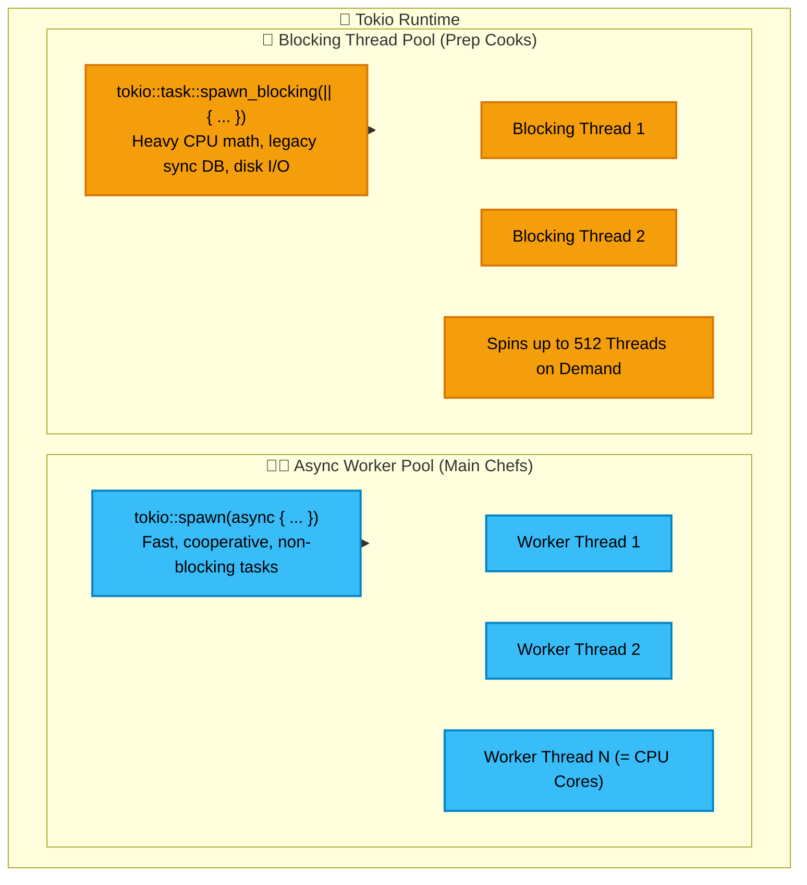
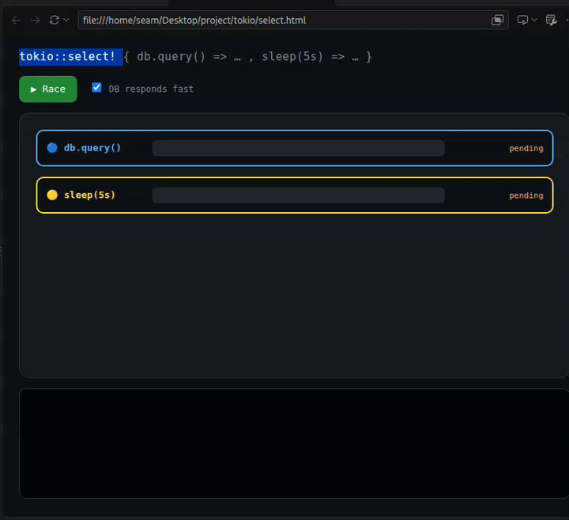
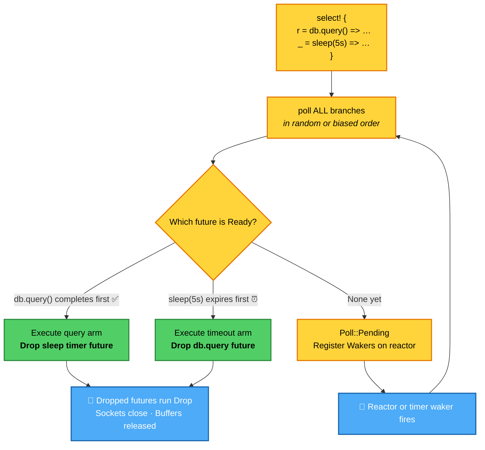
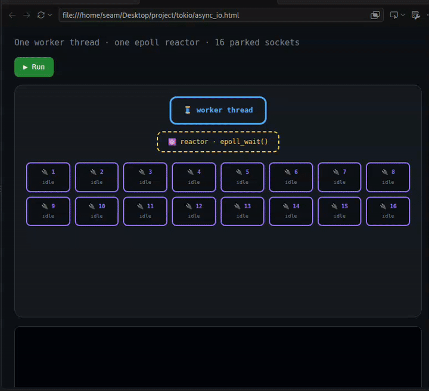
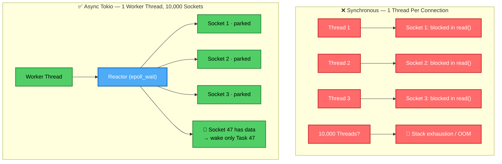
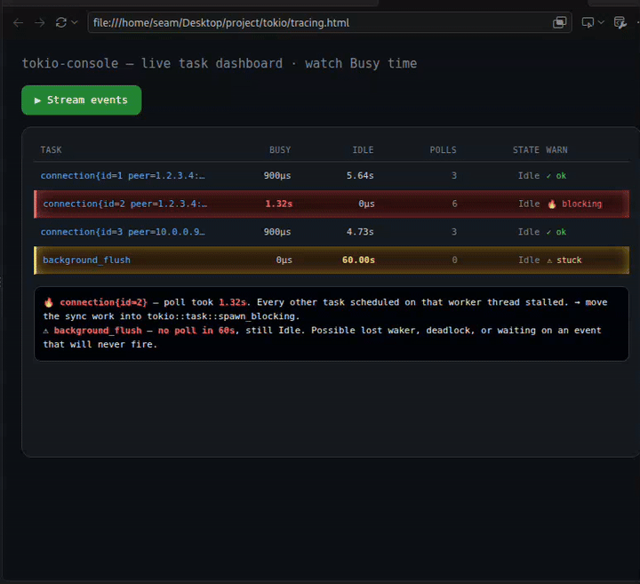
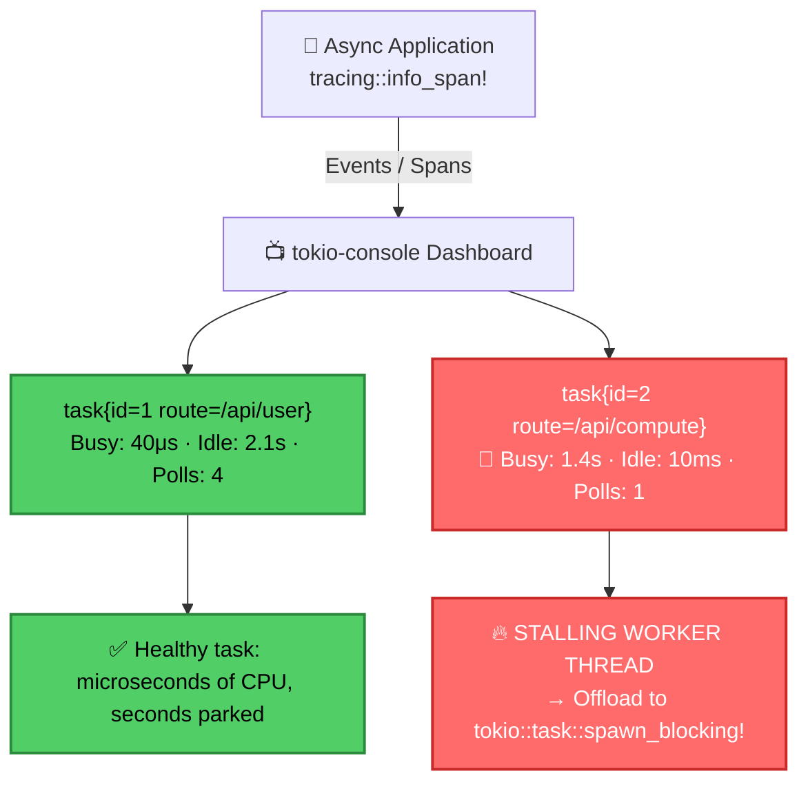
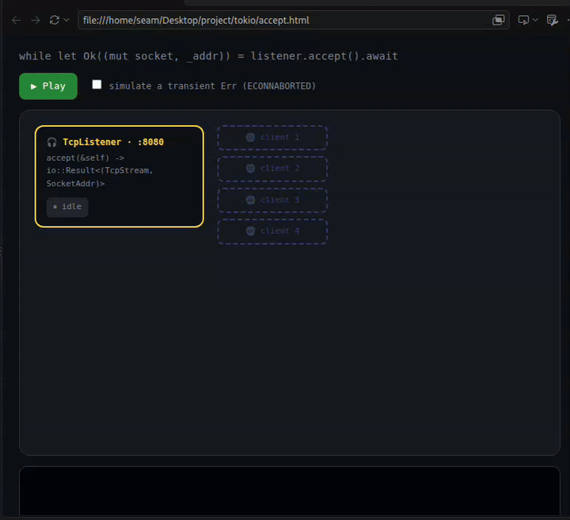
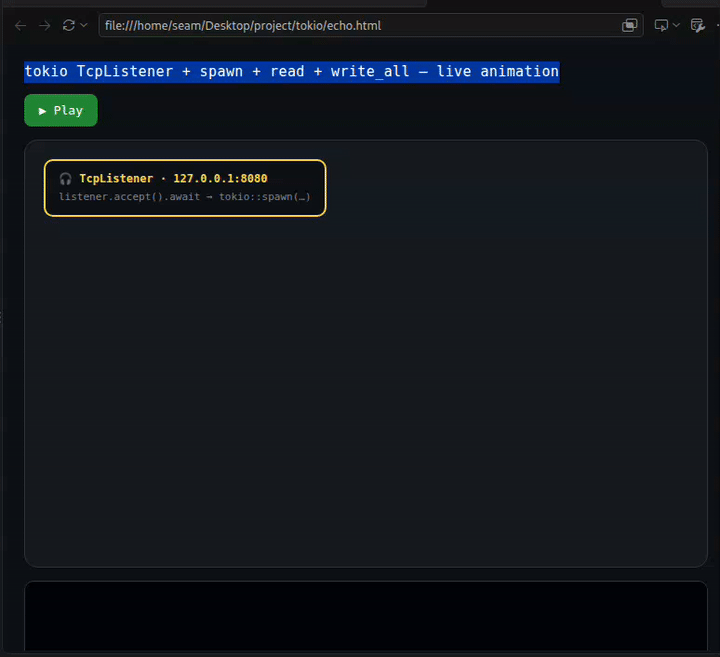
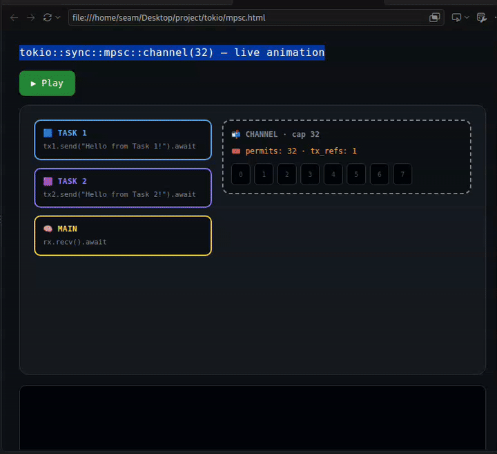

# 🦀 Tokio Runtime Studio — Architecture, Visualizations & Production Guide

[](https://github.com/sks006/tokio/actions/workflows/ci.yml)
[](https://tokio.rs)
[](https://www.rust-lang.org)
[](LICENSE)
[](index.html)

A monolithic, production-grade visual guide and executable reference suite for **Tokio**, Rust's asynchronous runtime. This repository bridges theoretical async runtime concepts with **live animated visual demonstrations**, **recorded video walkthroughs**, **high-resolution architectural maps**, and **verified production Rust implementations**.

---

## 🚀 Quickstart

### 1. Interactive Visual Studio & Video Catalog
Open [`index.html`](index.html) directly in any modern web browser or run locally:
```bash
# Using Node / NPX
npx serve .

# Or using Python 3
python3 -m http.server 8080
```

| Module | Architectural Topic | Live Animation Preview | High-Res Video | Interactive Simulator |
|---|---|---|---|---|
| **01** | Control Flow & `select!` | [`asset/select_animation.gif`](asset/select_animation.gif) | [🎥 `select_animation.mp4`](asset/select_animation.mp4) | [🕹️ `01_select.html`](simulations/01_select.html) |
| **02** | Async I/O & epoll Multiplexing | [`asset/async_io_animation.gif`](asset/async_io_animation.gif) | [🎥 `async_io_animation.mp4`](asset/async_io_animation.mp4) | [🕹️ `02_async_io.html`](simulations/02_async_io.html) |
| **03** | Tracing & `tokio-console` | [`asset/tracing_animation.gif`](asset/tracing_animation.gif) | [🎥 `tracing_animation.mp4`](asset/tracing_animation.mp4) | [🕹️ `03_tracing.html`](simulations/03_tracing.html) |
| **04** | Resilient `TcpListener` Accept Loop | [`asset/accept_animation.gif`](asset/accept_animation.gif) | [🎥 `accept_animation.mp4`](asset/accept_animation.mp4) | [🕹️ `04_accept.html`](simulations/04_accept.html) |
| **05** | High-Performance TCP Echo Pipeline | [`asset/echo_animation.gif`](asset/echo_animation.gif) | [🎥 `echo_animation.mp4`](asset/echo_animation.mp4) | [🕹️ `05_echo.html`](simulations/05_echo.html) |
| **06** | Bounded MPSC Channels & Permits | [`asset/mpsc_animation.gif`](asset/mpsc_animation.gif) | [🎥 `mpsc_animation.mp4`](asset/mpsc_animation.mp4) | [🕹️ `06_mpsc.html`](simulations/06_mpsc.html) |

### 2. Monolithic Rust Executable Suite
Run the companion production patterns directly from the unified CLI runner:
```bash
# Run the complete test suite & all 6 patterns sequentially
cargo run -- all

# Run specific architectural patterns:
cargo run -- 1      # 01: tokio::select! & Cancellation by Drop
cargo run -- 2      # 02: Async I/O & Reactor Multiplexing
cargo run -- 3      # 03: Structured Tracing & Non-Blocking Rules
cargo run -- 4      # 04: Resilient TcpListener Accept Loop
cargo run -- 5      # 05: High-Performance TCP Echo Pipeline
cargo run -- 6      # 06: Bounded MPSC Channels & Backpressure

# Run automated tests
cargo test
```

---

## 🏛️ The Tokio Execution Model: Dual-Pool Architecture

Under the hood, Tokio maintains **two completely separate thread pools** to ensure that compute-heavy or blocking operations never starve lightweight async network tasks:



1. **The Async Worker Pool (The Main Chefs 🧑‍🍳)**:
   - Sized to match available CPU cores.
   - Runs cooperative asynchronous tasks spawned with `tokio::spawn`.
   - **Requirement**: Tasks must yield frequently at `.await` suspension points. If a task runs synchronous compute without yielding, it starves that worker thread.
2. **The Blocking Thread Pool (The Dedicated Prep Cooks 🔪)**:
   - Dedicated backup pool that dynamically spins up to 512 threads.
   - Handles heavy CPU-bound math, synchronous file operations (`std::fs`), or legacy synchronous database drivers via `tokio::task::spawn_blocking`.
   - Allows the main worker threads to keep accepting new network requests without jitter.

```rust
// Heavy synchronous computation safely offloaded to the blocking threadpool
let result = tokio::task::spawn_blocking(|| {
    let mut total = 0u64;
    for i in 0..10_000_000 {
        total += i;
    }
    total
}).await?;
```

---

## 🔒 Shared State: `Arc<Mutex<T>>` vs. Message Passing

When multiple tasks need to coordinate, Tokio provides two primary paradigms:

### 1. Shared Memory: The `Arc<Mutex<T>>` Pattern
- **`Arc` (Atomic Reference Counted)**: Enables thread-safe shared ownership.
  - **Zero-Copy Cloning**: Calling `Arc::clone(&counter)` **does not copy the underlying data**. It simply allocates a new pointer and increments a tiny atomic integer counter.
- **`Mutex` (Mutual Exclusion)**: Ensures only one task can mutate the inner value at a time.
- **Automatic RAII Unlock**: Calling `.lock()` returns a `MutexGuard`. When `guard` exits scope at the closing brace `}`, Rust's ownership model **automatically unlocks the mutex**, preventing deadlocks.

```rust
use std::sync::{Arc, Mutex};

let active_users = Arc::new(Mutex::new(0));

for _ in 0..10 {
    let users_clone = Arc::clone(&active_users);
    tokio::spawn(async move {
        // Guard automatically releases lock at the end of this scope }
        let mut guard = users_clone.lock().unwrap();
        *guard += 1;
    });
}
```

> [!CAUTION]
> **Never hold a standard `std::sync::MutexGuard` across an `.await` boundary!**  
> If an async task holding a standard mutex yields at `.await`, another task on the same worker thread trying to acquire the mutex will cause a thread-level deadlock. Either drop the guard before `.await` using a scoped block, or use `tokio::sync::Mutex`.

---

## 🗺️ High-Resolution Architectural Maps

The repository includes high-resolution infographics detailing the internal structure and lifecycle of the Tokio runtime:

| Map | Preview | Details |
|---|---|---|
| **The Complete Map of Tokio** | [`asset/tokio_architecture_map.png`](asset/tokio_architecture_map.png) | High-resolution overview of Runtime, Reactor, Tasks, Schedulers, and I/O driver. |
| **Tokio Task & Future Lifecycle** | [`asset/tokio_lifecycle_map.png`](asset/tokio_lifecycle_map.png) | Step-by-step state machine from task spawn to `Poll::Pending`, Waker registration, reactor event, and completion. |

---

## 🔀 Part 1 — Control Flow & Cancellation by Drop

In asynchronous Rust, futures are **lazy**: they make no progress until polled. When racing futures inside `tokio::select!`, the runtime polls branches concurrently. Once any branch resolves to `Poll::Ready`, `select!` executes its arm and **immediately drops the remaining loser futures**.

Dropping a future triggers Rust's RAII destructors: pending timers are cancelled in the runtime timing wheel, TCP sockets close, and memory buffers are freed without leaks.

### 🎥 Live Animation Demo


> 🎬 **High-Res Video**: [`asset/select_animation.mp4`](asset/select_animation.mp4)  
> 🕹️ **Interactive Simulation**: [`simulations/01_select.html`](simulations/01_select.html)

### Decision Flowchart



### Production Pattern
```rust
tokio::select! {
    result = db_query().await => {
        println!("Query resolved: {result:?}");
        // Timer future dropped automatically
    }
    _ = tokio::time::sleep(Duration::from_secs(5)).await => {
        eprintln!("Query timed out after 5s!");
        // db_query() future dropped: socket closed, connection aborted cleanly
    }
}
```

---

## ⚡ Part 2 — Asynchronous I/O & OS Reactor Multiplexing

Traditional thread-per-connection architectures scale poorly: 10,000 idle threads consume gigabytes of stack memory and saturate kernel context-switching.

Tokio solves this using **non-blocking I/O multiplexing** (`epoll` on Linux, `kqueue` on macOS, `IOCP` on Windows). A tiny pool of worker threads can effortlessly service tens of thousands of idle connections. When a socket returns `WouldBlock`, the task parks, saves its `Waker`, and yields the thread. The OS reactor wakes only the exact task whose descriptor becomes readable.

### 🎥 Live Animation Demo


> 🎬 **High-Res Video**: [`asset/async_io_animation.mp4`](asset/async_io_animation.mp4)  
> 🕹️ **Interactive Simulation**: [`simulations/02_async_io.html`](simulations/02_async_io.html)



---

## 🔍 Part 3 — Observability, Tracing & `tokio-console`

In asynchronous runtimes, `println!` fails: logs from thousands of concurrently yielding tasks interleave and lose context. We replace `println!` with the **Tracing Trinity**:

1. **Spans ⏱️ ("Where am I?")**:
   - Represents a period of time with a beginning and end (e.g., client connection lifecycle).
   - Tasks carry the span context across `.await` points and thread hops via `.instrument(span)`.
2. **Fields 🏷️ ("Who is on the other end?")**:
   - Typed key-value pairs attached to a span (e.g., `client_ip = %addr`).
3. **Events 📝 ("What happened?")**:
   - Structured log statements with severity levels (`info!`, `warn!`, `error!`) that automatically inherit all enclosing span fields.

### 🎥 Live Animation Demo


> 🎬 **High-Res Video**: [`asset/tracing_animation.mp4`](asset/tracing_animation.mp4)  
> 🕹️ **Interactive Simulation**: [`simulations/03_tracing.html`](simulations/03_tracing.html)



### Catching CPU Hogs with `tokio-console`
`tokio-console` monitors task **Busy Time** (time spent executing inside `poll`) vs **Idle Time** (time spent parked waiting on reactor wakers).
- **Busy time > 10ms** is a major red flag indicating synchronous blocking code.
- **Remedy**: Move the synchronous code into `tokio::task::spawn_blocking`.

---

## 🛡️ Part 4 — Resilient `TcpListener` Accept Loop

A common rookie pitfall is:
```rust
// ❌ NAIVE: Exits loop permanently if a transient OS error occurs!
while let Ok((socket, addr)) = listener.accept().await {
    tokio::spawn(handle(socket));
}
```

In production networks, clients frequently abort handshakes (`ECONNABORTED`), or the process temporarily hits file descriptor limits (`EMFILE`). The naive `while let Ok` loop exits immediately on error, **killing the entire server**.

### 🎥 Live Animation Demo


> 🎬 **High-Res Video**: [`asset/accept_animation.mp4`](asset/accept_animation.mp4)  
> 🕹️ **Interactive Simulation**: [`simulations/04_accept.html`](simulations/04_accept.html)

### Production Resilient Pattern
```rust
loop {
    match listener.accept().await {
        Ok((socket, peer)) => {
            tokio::spawn(handle_connection(socket, peer));
        }
        Err(err) => {
            match err.kind() {
                std::io::ErrorKind::ConnectionAborted
                | std::io::ErrorKind::Interrupted => {
                    tracing::warn!(error = %err, "Transient network abort; retrying");
                    continue;
                }
                std::io::ErrorKind::WouldBlock => {
                    // Backoff briefly to allow OS table recovery
                    tokio::time::sleep(Duration::from_millis(10)).await;
                    continue;
                }
                fatal => {
                    tracing::error!(error = %fatal, "Fatal listener error; terminating");
                    break;
                }
            }
        }
    }
}
```

---

## 🔁 Part 5 — High-Performance TCP Echo Pipeline

Splitting a `TcpStream` into owned or borrowed halves enables concurrent, non-blocking reads and writes without mutex contention:

### 🎥 Live Animation Demo


> 🎬 **High-Res Video**: [`asset/echo_animation.mp4`](asset/echo_animation.mp4)  
> 🕹️ **Interactive Simulation**: [`simulations/05_echo.html`](simulations/05_echo.html)

```rust
// Split stream into reader and writer halves
let (mut reader, mut writer) = stream.split();

// Zero-copy asynchronous piping
tokio::io::copy(&mut reader, &mut writer).await?;
```

### 🚪 The `Ok(0)` EOF Disconnect Rule & The 100% CPU Infinite Loop Trap

When reading from a TCP socket in a loop:
```rust
loop {
    match socket.read(&mut buf).await {
        Ok(0) => {
            // 🔑 CRITICAL: Ok(0) means End-of-File (client closed connection)!
            break;
        }
        Ok(n) => {
            socket.write_all(&buf[0..n]).await?;
        }
        Err(e) => {
            eprintln!("Socket read error: {e}");
            break;
        }
    }
}
```

> [!WARNING]
> **Why `Ok(0)` is NOT an error**: When a client closes a TCP socket cleanly, the OS kernel notifies the socket with EOF, returning `Ok(0)`.  
> If you fail to check `if n == 0 { break; }`, `socket.read()` will never pause again—it will instantly return `Ok(0)` millions of times a second in a runaway loop, **pegging a CPU core at 100%**!

---

## 📬 Part 6 — Bounded MPSC Channels, Backpressure & Shutdown

Tokio's `mpsc::channel(capacity)` provides bounded buffering for inter-task communication:

### 🎥 Live Animation Demo


> 🎬 **High-Res Video**: [`asset/mpsc_animation.mp4`](asset/mpsc_animation.mp4)  
> 🕹️ **Interactive Simulation**: [`simulations/06_mpsc.html`](simulations/06_mpsc.html)

### 🚰 Capacity vs. Backpressure
- `mpsc::channel(32)` sets the **maximum in-flight buffer capacity**, NOT the total number of messages in the lifetime of the program.
- If 32 unread messages are queued, the 33rd `tx.send().await` call will **asynchronously pause and yield**, preventing slow consumers from causing out-of-memory (OOM) crashes.

### 🔑 The Coordinator Handle Drop Rule:
`rx.recv()` returns `Some(msg)` until **all** `Sender` handles are dropped. If the coordinating thread clones `tx` for workers but forgets to `drop(tx)` itself, `rx.recv().await` **will hang forever waiting for more messages**.

```rust
let (tx, mut rx) = mpsc::channel(32);

let tx1 = tx.clone();
tokio::spawn(async move {
    tx1.send("task 1").await.unwrap();
    // tx1 dropped automatically when task exits scope }
});

// 🔑 CRITICAL: Drop original coordinator sender handle!
drop(tx);

// Now the receiver loop cleanly terminates when all workers finish!
while let Some(msg) = rx.recv().await {
    println!("Processed: {msg}");
}
// rx.recv() returns None; loop exits gracefully
```

---

## 📋 Tokio Cancellation Safety Matrix

| Primitive | Cancel Safe? | Details |
|---|:---:|---|
| `tokio::select!` | ✅ Safe | Races branches; drops losers without leaking state. |
| `TcpListener::accept()` | ✅ Safe | If dropped before ready, socket remains undisturbed in kernel listen queue. |
| `AsyncReadExt::read()` | ✅ Safe | No bytes transferred until `Poll::Ready(Ok(n))`. |
| `AsyncWriteExt::write_all()` | ❌ **UNSAFE** | May write partial buffer before cancellation, corrupting stream framing. |
| `mpsc::Receiver::recv()` | ✅ Safe | Unconsumed messages remain in channel buffer for subsequent calls. |
| `mpsc::Sender::send()` | ⚠️ Conditional | If cancelled, message is not sent; slot permit remains unconsumed. |
| `tokio::time::sleep()` | ✅ Safe | Cancels timer wheel entry without side effects. |
| `tokio::spawn()` | ✅ Safe | Returns `JoinHandle`; cancellation via `.abort()`. |
| `tokio::task::spawn_blocking()` | ⚠️ Conditional | Cannot interrupt running synchronous thread; JoinHandle cancellation detaches. |

---

## 📦 Project Layout

```text
tokio/
├── index.html                    # 🌟 Monolithic Interactive Visual Studio & Reference
├── simulations/                  # 🎬 Organized Interactive Visual Simulations
│   ├── 01_select.html            # Pattern 1: tokio::select! race & cancel animation
│   ├── 02_async_io.html          # Pattern 2: Async I/O reactor & 16 sockets animation
│   ├── 03_tracing.html           # Pattern 3: Tracing & tokio-console live dashboard
│   ├── 04_accept.html            # Pattern 4: Resilient accept loop animation
│   ├── 05_echo.html              # Pattern 5: TCP echo server animation
│   └── 06_mpsc.html              # Pattern 6: Bounded MPSC channel animation
├── asset/                        # 🎥 Video Demonstrations & High-Res Infographics
│   ├── select_animation.gif      # Live GIF: tokio::select! animation (GitHub native)
│   ├── select_animation.mp4      # High-Res Video: tokio::select! animation
│   ├── async_io_animation.gif    # Live GIF: Async I/O reactor animation (GitHub native)
│   ├── async_io_animation.mp4    # High-Res Video: Async I/O reactor animation
│   ├── tracing_animation.gif     # Live GIF: Tracing & tokio-console animation (GitHub native)
│   ├── tracing_animation.mp4     # High-Res Video: Tracing & tokio-console animation
│   ├── accept_animation.gif      # Live GIF: Resilient accept loop animation (GitHub native)
│   ├── accept_animation.mp4      # High-Res Video: Resilient accept loop animation
│   ├── echo_animation.gif        # Live GIF: TCP echo server animation (GitHub native)
│   ├── echo_animation.mp4        # High-Res Video: TCP echo server animation
│   ├── mpsc_animation.gif        # Live GIF: Bounded MPSC channel animation (GitHub native)
│   ├── mpsc_animation.mp4        # High-Res Video: Bounded MPSC channel animation
│   ├── tokio_architecture_map.png# High-res Tokio Architecture Infographic
│   └── tokio_lifecycle_map.png   # High-res Task & Future Lifecycle Infographic
├── doces/
│   └── 🧵Learning Rust Tokio.pdf # Community documentation & reference guide
├── src/
│   ├── main.rs                   # 🦀 Monolithic CLI Runner (all 6 patterns)
│   └── lib.rs                    # Reusable async modules & traits (including Arc<Mutex<T>>)
├── examples/
│   ├── 01_select_timeout.rs      # Pattern 1 executable
│   ├── 02_async_io_reactor.rs    # Pattern 2 executable
│   ├── 03_tracing_console.rs     # Pattern 3 executable
│   ├── 04_tcp_accept_resilient.rs# Pattern 4 executable
│   ├── 05_echo_server.rs         # Pattern 5 executable
│   └── 06_mpsc_backpressure.rs   # Pattern 6 executable
├── tests/
│   └── integration_tests.rs      # Automated test suite (all patterns verified)
├── .github/workflows/
│   └── ci.yml                    # Automated CI test & GitHub Pages deploy workflow
├── Cargo.toml                    # Package manifest & dependencies
├── LICENSE                       # Dual MIT / Apache-2.0 license
├── CONTRIBUTING.md               # Contribution guide
└── package.json                  # Convenience scripts for web serving
```

---

## 🤝 Contributing & License

Contributions, improvements, and additional visual modules are welcome! See [`CONTRIBUTING.md`](CONTRIBUTING.md) for details.

Dual-licensed under either of:
- **MIT License** ([LICENSE-MIT](LICENSE-MIT))
- **Apache License, Version 2.0** ([LICENSE-APACHE](LICENSE-APACHE))
