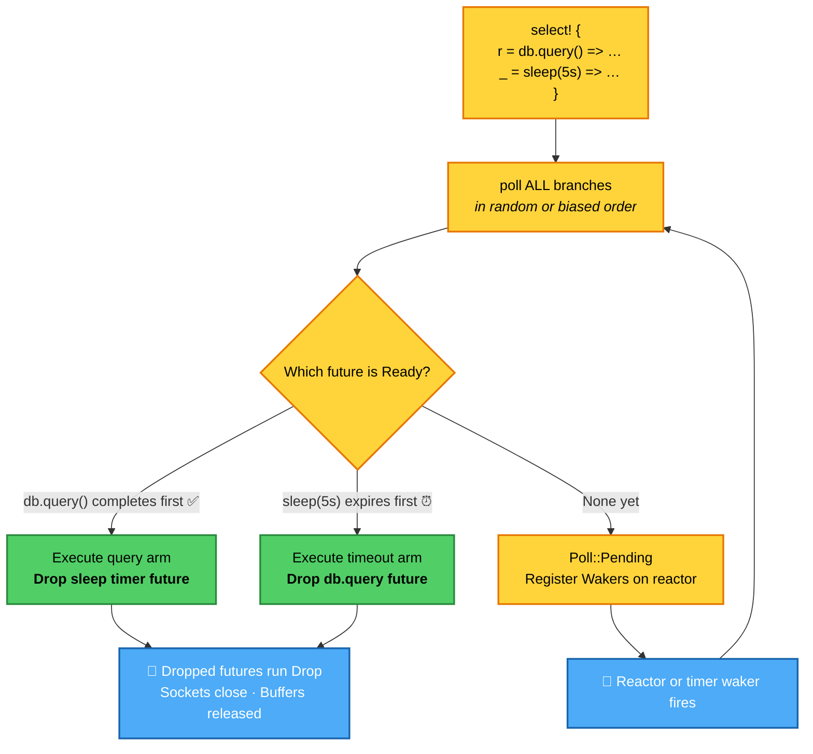
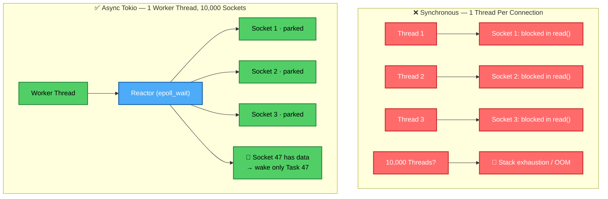
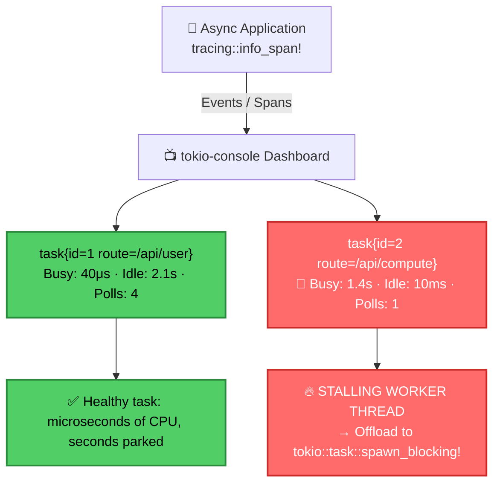

# 🦀 Tokio Runtime Studio — Architecture, Visualizations & Production Guide

[](https://github.com/sks006/tokio/actions/workflows/ci.yml)
[](https://tokio.rs)
[](https://www.rust-lang.org)
[](LICENSE)
[](index.html)

A monolithic, production-grade visual guide and executable reference suite for **Tokio**, Rust's asynchronous runtime. This repository bridges theoretical async runtime concepts with **recorded video demonstrations**, **interactive browser animations**, **high-resolution architectural maps**, and **verified production Rust implementations**.

---

## 🚀 Quickstart

### 1. Interactive Visual Studio & Video Catalog
Open [`index.html`](index.html) directly in any modern web browser or run locally:
```bash
# Using Node / NPX
npx serve .

# Or using Python 3
python3 -m http.server 8080
```

| Module | Architectural Topic | Video Recording | Interactive Simulator |
|---|---|---|---|
| **01** | Control Flow & `select!` | [🎥 `select_animation.mp4`](asset/select_animation.mp4) | [🕹️ `01_select.html`](simulations/01_select.html) |
| **02** | Async I/O & epoll Multiplexing | [🎥 `async_io_animation.mp4`](asset/async_io_animation.mp4) | [🕹️ `02_async_io.html`](simulations/02_async_io.html) |
| **03** | Tracing & `tokio-console` | [🎥 `tracing_animation.mp4`](asset/tracing_animation.mp4) | [🕹️ `03_tracing.html`](simulations/03_tracing.html) |
| **04** | Resilient `TcpListener` Accept Loop | [🎥 `accept_animation.mp4`](asset/accept_animation.mp4) | [🕹️ `04_accept.html`](simulations/04_accept.html) |
| **05** | High-Performance TCP Echo Pipeline | [🎥 `echo_animation.mp4`](asset/echo_animation.mp4) | [🕹️ `05_echo.html`](simulations/05_echo.html) |
| **06** | Bounded MPSC Channels & Permits | [🎥 `mpsc_animation.mp4`](asset/mpsc_animation.mp4) | [🕹️ `06_mpsc.html`](simulations/06_mpsc.html) |

### 2. Monolithic Rust Executable Suite
Run the companion production patterns directly from the unified CLI runner:
```bash
# Run the complete test suite & all 6 patterns sequentially
cargo run -- all

# Run specific architectural patterns:
cargo run -- 1      # 01: tokio::select! & Cancellation by Drop
cargo run -- 2      # 02: Async I/O & Reactor Multiplexing
cargo run -- 3      # 03: Structured Tracing & Non-Blocking Rules
cargo run -- 4      # 04: Resilient TcpListener Accept Loop
cargo run -- 5      # 05: High-Performance TCP Echo Pipeline
cargo run -- 6      # 06: Bounded MPSC Channels & Backpressure

# Run automated tests
cargo test
```

---

## 🗺️ High-Resolution Architectural Maps

The repository includes high-resolution infographics detailing the internal structure and lifecycle of the Tokio runtime:

| Map | Preview | Details |
|---|---|---|
| **The Complete Map of Tokio** | [`asset/tokio_architecture_map.png`](asset/tokio_architecture_map.png) | High-resolution overview of Runtime, Reactor, Tasks, Schedulers, and I/O driver. |
| **Tokio Task & Future Lifecycle** | [`asset/tokio_lifecycle_map.png`](asset/tokio_lifecycle_map.png) | Step-by-step state machine from task spawn to `Poll::Pending`, Waker registration, reactor event, and completion. |

---

## 🔀 Part 1 — Control Flow & Cancellation by Drop

In asynchronous Rust, futures are **lazy**: they make no progress until polled. When racing futures inside `tokio::select!`, the runtime polls branches concurrently. Once any branch resolves to `Poll::Ready`, `select!` executes its arm and **immediately drops the remaining loser futures**.

Dropping a future triggers Rust's RAII destructors: pending timers are cancelled in the runtime timing wheel, TCP sockets close, and memory buffers are freed without leaks.

### 🎥 Video Demonstration
<video src="asset/select_animation.mp4" controls width="100%"></video>

> 🔗 **Direct Video Link**: [`asset/select_animation.mp4`](asset/select_animation.mp4)  
> 🕹️ **Interactive Animation**: [`simulations/01_select.html`](simulations/01_select.html)

### Decision Flowchart



### Production Pattern
```rust
tokio::select! {
    result = db_query().await => {
        println!("Query resolved: {result:?}");
        // Timer future dropped automatically
    }
    _ = tokio::time::sleep(Duration::from_secs(5)).await => {
        eprintln!("Query timed out after 5s!");
        // db_query() future dropped: socket closed, connection aborted cleanly
    }
}
```

---

## ⚡ Part 2 — Asynchronous I/O & OS Reactor Multiplexing

Traditional thread-per-connection architectures scale poorly: 10,000 idle threads consume gigabytes of stack memory and saturate kernel context-switching.

Tokio solves this using **non-blocking I/O multiplexing** (`epoll` on Linux, `kqueue` on macOS, `IOCP` on Windows). A tiny pool of worker threads can effortlessly service tens of thousands of idle connections. When a socket returns `WouldBlock`, the task parks, saves its `Waker`, and yields the thread. The OS reactor wakes only the exact task whose descriptor becomes readable.

### 🎥 Video Demonstration
<video src="asset/async_io_animation.mp4" controls width="100%"></video>

> 🔗 **Direct Video Link**: [`asset/async_io_animation.mp4`](asset/async_io_animation.mp4)  
> 🕹️ **Interactive Animation**: [`simulations/02_async_io.html`](simulations/02_async_io.html)



---

## 🔍 Part 3 — Observability & `tokio-console`

Asynchronous bugs rarely crash; they **hang**. If a developer calls `std::thread::sleep` or acquires a blocking `std::sync::Mutex` inside an async task, that entire worker thread stalls, starving every other task scheduled on the same thread.

Using `tracing` and `tokio-console`, you monitor real-time task telemetry:

### 🎥 Video Demonstration
<video src="asset/tracing_animation.mp4" controls width="100%"></video>

> 🔗 **Direct Video Link**: [`asset/tracing_animation.mp4`](asset/tracing_animation.mp4)  
> 🕹️ **Interactive Animation**: [`simulations/03_tracing.html`](simulations/03_tracing.html)



### The Golden Rule:
> **Never perform blocking computation or sync I/O directly in an async task.**  
> Move CPU-heavy work to `tokio::task::spawn_blocking`:
```rust
// ✅ Proper offloading to dedicated threadpool
let result = tokio::task::spawn_blocking(move || {
    heavy_cpu_crypto_or_disk_operation()
}).await?;
```

---

## 🛡️ Part 4 — Resilient `TcpListener` Accept Loop

A common rookie pitfall is:
```rust
// ❌ NAIVE: Exits loop permanently if a transient OS error occurs!
while let Ok((socket, addr)) = listener.accept().await {
    tokio::spawn(handle(socket));
}
```

In production networks, clients frequently abort handshakes (`ECONNABORTED`), or the process temporarily hits file descriptor limits (`EMFILE`). The naive `while let Ok` loop exits immediately on error, **killing the entire server**.

### 🎥 Video Demonstration
<video src="asset/accept_animation.mp4" controls width="100%"></video>

> 🔗 **Direct Video Link**: [`asset/accept_animation.mp4`](asset/accept_animation.mp4)  
> 🕹️ **Interactive Animation**: [`simulations/04_accept.html`](simulations/04_accept.html)

### Production Resilient Pattern
```rust
loop {
    match listener.accept().await {
        Ok((socket, peer)) => {
            tokio::spawn(handle_connection(socket, peer));
        }
        Err(err) => {
            match err.kind() {
                std::io::ErrorKind::ConnectionAborted
                | std::io::ErrorKind::Interrupted => {
                    tracing::warn!(error = %err, "Transient network abort; retrying");
                    continue;
                }
                std::io::ErrorKind::WouldBlock => {
                    // Backoff briefly to allow OS table recovery
                    tokio::time::sleep(Duration::from_millis(10)).await;
                    continue;
                }
                fatal => {
                    tracing::error!(error = %fatal, "Fatal listener error; terminating");
                    break;
                }
            }
        }
    }
}
```

---

## 🔁 Part 5 — High-Performance TCP Echo Pipeline

Splitting a `TcpStream` into owned or borrowed halves enables concurrent, non-blocking reads and writes without mutex contention:

### 🎥 Video Demonstration
<video src="asset/echo_animation.mp4" controls width="100%"></video>

> 🔗 **Direct Video Link**: [`asset/echo_animation.mp4`](asset/echo_animation.mp4)  
> 🕹️ **Interactive Animation**: [`simulations/05_echo.html`](simulations/05_echo.html)

```rust
// Split stream into reader and writer halves
let (mut reader, mut writer) = stream.split();

// Zero-copy asynchronous piping
tokio::io::copy(&mut reader, &mut writer).await?;
```

---

## 📬 Part 6 — Bounded MPSC Channels & Backpressure

Tokio's `mpsc::channel(capacity)` provides bounded buffering. If the buffer is full, senders await permits asynchronously, propagating natural backpressure through the pipeline.

### 🎥 Video Demonstration
<video src="asset/mpsc_animation.mp4" controls width="100%"></video>

> 🔗 **Direct Video Link**: [`asset/mpsc_animation.mp4`](asset/mpsc_animation.mp4)  
> 🕹️ **Interactive Animation**: [`simulations/06_mpsc.html`](simulations/06_mpsc.html)

### The Coordinator Handle Drop Rule:
`rx.recv()` returns `Some(msg)` until **all** `Sender` handles are dropped. If the coordinating thread clones `tx` for workers but forgets to `drop(tx)` itself, `rx.recv().await` **will hang forever waiting for more messages**.

```rust
let (tx, mut rx) = mpsc::channel(32);

let tx1 = tx.clone();
tokio::spawn(async move {
    tx1.send("task 1").await.unwrap();
    // tx1 dropped here
});

// 🔑 CRITICAL: Drop original sender in coordinator!
drop(tx);

// Now the receiver loop cleanly terminates when workers finish!
while let Some(msg) = rx.recv().await {
    println!("Processed: {msg}");
}
```

---

## 📋 Tokio Cancellation Safety Matrix

| Primitive | Cancel Safe? | Details |
|---|:---:|---|
| `tokio::select!` | ✅ Safe | Races branches; drops losers without leaking state. |
| `TcpListener::accept()` | ✅ Safe | If dropped before ready, socket remains undisturbed in kernel listen queue. |
| `AsyncReadExt::read()` | ✅ Safe | No bytes transferred until `Poll::Ready(Ok(n))`. |
| `AsyncWriteExt::write_all()` | ❌ **UNSAFE** | May write partial buffer before cancellation, corrupting stream framing. |
| `mpsc::Receiver::recv()` | ✅ Safe | Unconsumed messages remain in channel buffer for subsequent calls. |
| `mpsc::Sender::send()` | ⚠️ Conditional | If cancelled, message is not sent; slot permit remains unconsumed. |
| `tokio::time::sleep()` | ✅ Safe | Cancels timer wheel entry without side effects. |
| `tokio::spawn()` | ✅ Safe | Returns `JoinHandle`; cancellation via `.abort()`. |

---

## 📦 Project Layout

```text
tokio/
├── index.html                    # 🌟 Monolithic Interactive Visual Studio & Reference
├── simulations/                  # 🎬 Organized Interactive Visual Simulations
│   ├── 01_select.html            # Pattern 1: tokio::select! race & cancel animation
│   ├── 02_async_io.html          # Pattern 2: Async I/O reactor & 16 sockets animation
│   ├── 03_tracing.html           # Pattern 3: Tracing & tokio-console live dashboard
│   ├── 04_accept.html            # Pattern 4: Resilient accept loop animation
│   ├── 05_echo.html              # Pattern 5: TCP echo server animation
│   └── 06_mpsc.html              # Pattern 6: Bounded MPSC channel animation
├── asset/                        # 🎥 Video Demonstrations & High-Res Infographics
│   ├── select_animation.mp4      # Video 1: tokio::select! animation
│   ├── async_io_animation.mp4    # Video 2: Async I/O reactor animation
│   ├── tracing_animation.mp4     # Video 3: Tracing & tokio-console animation
│   ├── accept_animation.mp4      # Video 4: Resilient accept loop animation
│   ├── echo_animation.mp4        # Video 5: TCP echo server animation
│   ├── mpsc_animation.mp4        # Video 6: Bounded MPSC channel animation
│   ├── tokio_architecture_map.png# High-res Tokio Architecture Infographic
│   └── tokio_lifecycle_map.png   # High-res Task & Future Lifecycle Infographic
├── doces/
│   └── 🧵Learning Rust Tokio.pdf # Community documentation & reference guide
├── src/
│   ├── main.rs                   # 🦀 Monolithic CLI Runner (all 6 patterns)
│   └── lib.rs                    # Reusable async modules & traits
├── examples/
│   ├── 01_select_timeout.rs      # Pattern 1 executable
│   ├── 02_async_io_reactor.rs    # Pattern 2 executable
│   ├── 03_tracing_console.rs     # Pattern 3 executable
│   ├── 04_tcp_accept_resilient.rs# Pattern 4 executable
│   ├── 05_echo_server.rs         # Pattern 5 executable
│   └── 06_mpsc_backpressure.rs   # Pattern 6 executable
├── tests/
│   └── integration_tests.rs      # Automated test suite
├── .github/workflows/
│   └── ci.yml                    # Automated CI test & GitHub Pages deploy workflow
├── Cargo.toml                    # Package manifest & dependencies
├── LICENSE                       # Dual MIT / Apache-2.0 license
├── CONTRIBUTING.md               # Contribution guide
└── package.json                  # Convenience scripts for web serving
```

---

## 🤝 Contributing & License

Contributions, improvements, and additional visual modules are welcome! See [`CONTRIBUTING.md`](CONTRIBUTING.md) for details.

Dual-licensed under either of:
- **MIT License** ([LICENSE-MIT](LICENSE-MIT))
- **Apache License, Version 2.0** ([LICENSE-APACHE](LICENSE-APACHE))
